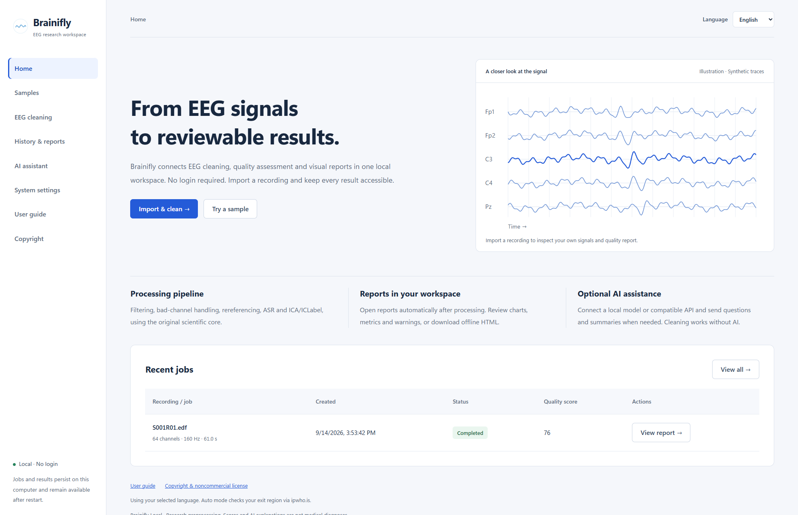
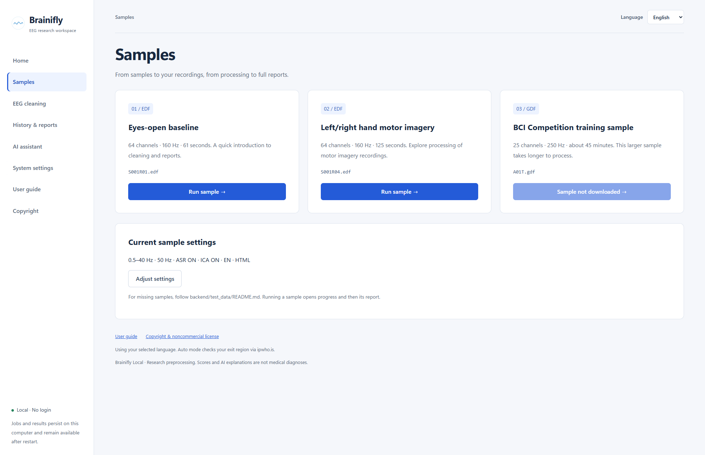
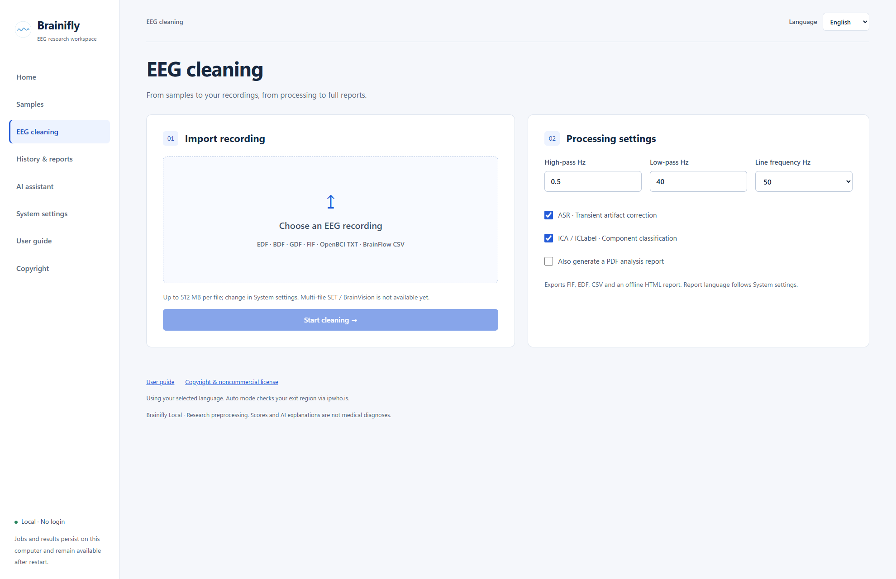
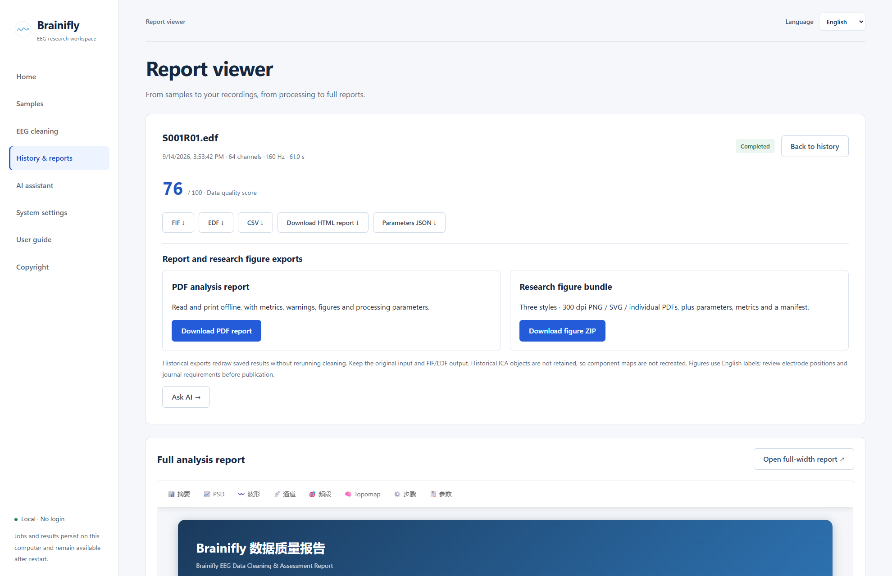
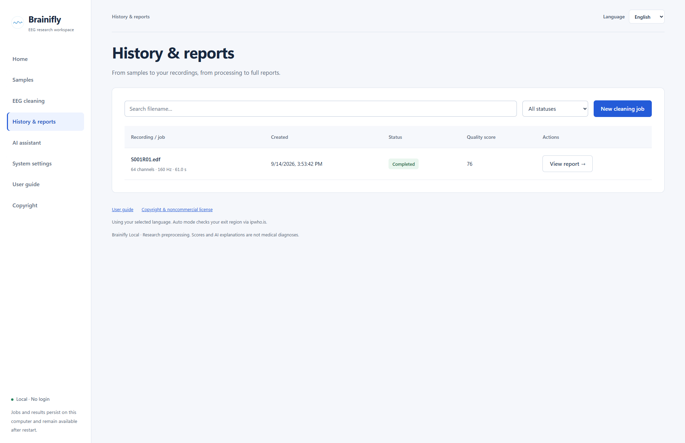
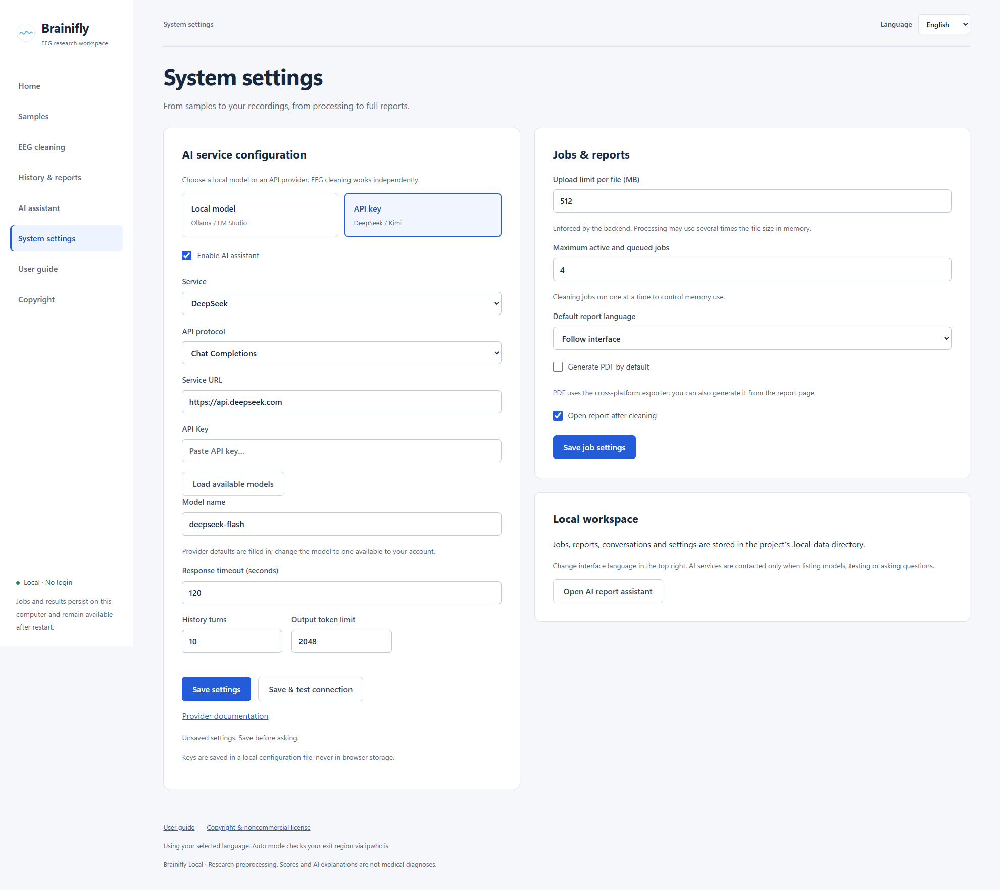
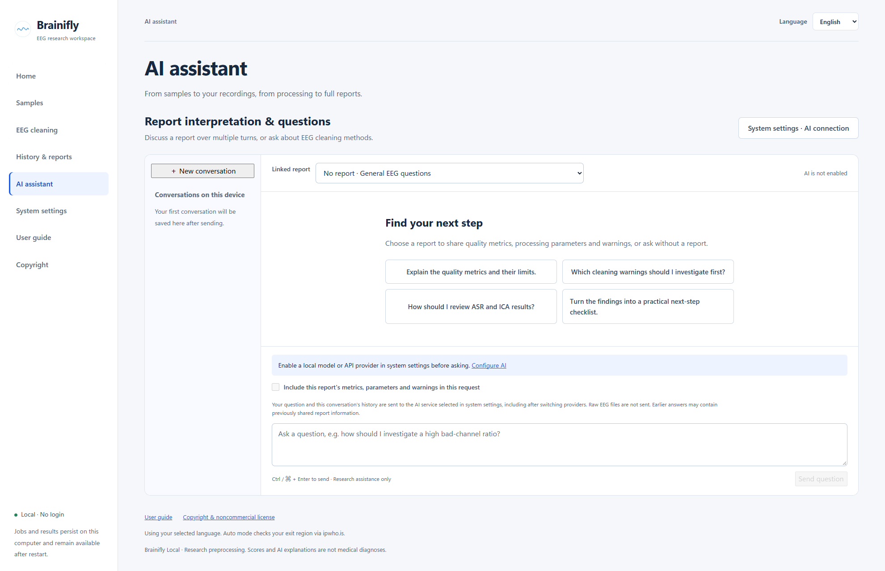

# OpenBrainEEG User guide

Brainifly Local · 2026-09-14

Screenshots show a real isolated workspace using public PhysioNet samples. They contain no private recordings, real API keys or generated AI conclusions. Settings show an unsaved DeepSeek preset; no AI request was sent. The English-interface report screenshot retains the Chinese report language selected when the sample job was submitted.

## Getting started

OpenBrainEEG is the local Brainifly EEG workspace. No login is required. Begin with a public sample before processing your own recording.

```text
python start.py setup
python start.py

# macOS
python3.11 start.py setup
python3.11 start.py
```

1. Install Python 3.11+ and Node.js 22. Extract the package and open a terminal in the folder containing start.py. Use python on Windows; use python3.11 (or your installed Python 3.11+) on macOS.
2. Run setup once to install dependencies and build the interface. This needs internet access and disk space. Start directly on later visits.
3. Open http://127.0.0.1:8765 and keep the terminal running. Choose Chinese or English in the top-right selector.
4. Press Ctrl+C to stop and allow running jobs to finish. Avoid force-closing the process during cleaning.



> Cleaning uses local computing resources; AI is off by default. This edition is for one local user. Do not expose the service to the internet.

## Run your first sample

Two PhysioNet EDF files are included. Start with the 61-second eyes-open baseline to explore progress and report viewing.

1. Open Samples and check that S001R01.edf has a Run sample button. The third GDF sample is not distributed; its unavailable state is expected.
2. Review the parameters below the samples. To change them, visit EEG cleaning, adjust settings and return.
3. Run the first sample to open job progress. Duration depends on hardware and settings. Avoid duplicate submissions.
4. The report opens automatically by default. If automatic opening is disabled, choose View full report or open it from history.



> Samples demonstrate the workflow; they do not provide clinical conclusions. Attribution and data licensing are listed on the Copyright page.

## Import and clean a recording

Cleaning creates new outputs. Keep a separate backup of the original data and validate settings on a short recording before using large files.

1. Open EEG cleaning and select one EDF, BDF, GDF, FIF, OpenBCI TXT or BrainFlow CSV file. TXT/CSV must match the acquisition format; arbitrary spreadsheets are not supported. Multi-file SET and BrainVision are unavailable.
2. Set high-pass, low-pass and 50/60 Hz line frequency. Defaults are 0.5–40 Hz and 50 Hz; validate these starting values against sampling rate and research goals.
3. Enable ASR and ICA/ICLabel as needed. Automatic artifact correction can alter useful signal; review logs, waveforms and component results afterwards.
4. HTML is generated by default. Select Also generate a PDF analysis report to create PDF after cleaning, or generate it later from the report page. Start cleaning and inspect errors and warnings.
5. If the upload exceeds the limit, adjust System settings before retrying. Processing large recordings may require several times their file size in memory.



> Upload and queue limits protect local resources; they are not paid quotas. Cleaning jobs run sequentially.

## Review and download reports

A report is a reviewable processing record. Quality scores describe computed data metrics, not brain health or a diagnosis.

1. Check the filename, channel count, sampling rate and duration to confirm the recording.
2. Read warnings first, then inspect metrics and figures in the full report. Some failed steps may still leave outputs; Completed alone does not establish usability.
3. Use the embedded report on a large display, or choose Open full-width report for more space. Scroll within the report to inspect chapters and figures.
4. Download HTML for offline viewing; FIF, EDF, CSV and parameters JSON are also available. In Report and research figure exports, choose Generate PDF report, then Download PDF report when ready. Cleaning is not rerun.
5. Expand Parameters & processing log for reproducibility. Choose Ask AI to discuss metrics in the separate assistant.
6. Generate the research figure bundle, then download its ZIP. It contains black-and-white, color and presentation styles in 300 dpi PNG, SVG and individual PDF, with parameters, metrics, steps and manifest.json. Redrawing needs saved inputs and FIF/EDF outputs; historical ICA objects are not recreated. Review export notices and the manifest for missing figures, coordinates or partial failures.



> Compare signals before and after processing and inspect the frequency bands relevant to your study. A higher score does not guarantee a more correct analysis.

## History and local storage

Closing the page or restarting the service does not delete saved jobs and reports.

1. Open History & reports. Search by filename or filter by status such as Completed, Failed or Running.
2. Choose View report for finished jobs or View job for progress and errors.
3. Force-interrupted jobs do not resume computation automatically. Review the failure after restarting and submit again.
4. Jobs, uploaded inputs, outputs, AI settings and conversations live in .local-data. Stop the service before backing up the entire directory.
5. Backups may contain API keys and sensitive recordings. Never upload them to a public repository. There is no automatic cleanup or bulk-delete button; back up before manual maintenance.



## System settings and AI connections

Job preferences and AI connections are saved separately. Cleaning does not depend on AI; configure a service before testing it.

1. Jobs & reports: set upload limit (1–8192 MB), active/queued jobs (1–16), report language, default PDF and automatic report opening, then Save job settings. Changes affect new jobs, not old reports.
2. DeepSeek: select API key → DeepSeek. Check the Chat Completions protocol and https://api.deepseek.com URL, then enter your own API key.
3. Load available models and choose a text chat model supported by your account, or enter a model ID from provider documentation. Preset names may become outdated. Save & test connection before opening the assistant.
4. Local Ollama: install and start Ollama and download a local text model first. Choose Local model → Ollama, use http://localhost:11434, load or enter the installed model name, then save and test. Do not append /api here.
5. LM Studio: load a model and start its local server first. Choose LM Studio with Chat Completions; the usual URL is http://localhost:1234/v1. Match the port to your server.
6. Re-enter the key when changing service or URL. On the same service, an empty field preserves the saved key. Adjust timeout, history turns and output limit here, then Save settings.



> Testing sends a short question and may incur API charges; it sends no recording or report. Keys live in a local configuration file, not an encrypted vault. A localhost service may itself proxy to the cloud; verify how your model server operates.

[DeepSeek API](https://api-docs.deepseek.com/)

[Ollama API](https://docs.ollama.com/api/introduction)

[LM Studio](https://lmstudio.ai/docs/developer/openai-compat)

## AI report interpretation and questions

The AI assistant is a separate workspace. It uses your questions, explicitly included summaries and conversation history; it does not read raw EEG files.

1. Enable AI and test the connection in System settings. Open AI assistant and choose New conversation.
2. Link a completed report, or leave it unlinked for general methods questions. Ask AI on a report page selects that report for you.
3. To provide report context, check Include this report’s metrics, parameters and warnings in this request. Selecting a report alone does not send its summary.
4. Type a question or select a suggested prompt, then Send question. Ctrl / ⌘ + Enter also sends. Ask which warnings need review or how to inspect ASR and ICA results.
5. Follow-up requests include recent conversation turns according to settings. After changing providers, history goes to the new service too; earlier answers may contain previously shared report information.
6. Conversations are stored locally. Each conversation keeps its linked report; start a new one for a different report. Check AI conclusions and references against the original report.



> Disable AI in settings when it is not needed. AI may omit information, misread metrics or invent conclusions. Do not use it for diagnosis or treatment.

## Troubleshooting

Record the visible error and job warnings before troubleshooting. Share only redacted information when reporting a problem.

1. Page unavailable: keep the startup terminal running and open http://127.0.0.1:8765. If the port is occupied, check whether another instance is already running.
2. Node/Python not found: reopen the terminal after installation and check node --version and python --version (or your macOS Python command). After editing UI code, run python start.py build and refresh.
3. Connection test fails: check keys/permissions for 401/403, account balance for insufficient funds, and quotas/rate limits for 429. Reload models for unknown IDs; check network, service and timeout for timeouts. Settings may have been saved before a failed test; save and test again after editing.
4. Local connection refused: start the model server, match the port and install the model. localhost means the computer running this backend, not another computer.
5. Cleaning fails or results look wrong: check format, sampling rate, channels, recording length, memory and parameters. Inspect errors and step warnings. Try a bundled sample to separate installation problems from input problems.
6. PDF / figure export fails: inspect the error on the report page and ensure original inputs and FIF/EDF outputs still exist. On older installations, run python start.py setup to install reportlab. Fix the cause and Retry export; export failures do not change cleaning status or HTML.
7. Wrong language: choose manually in the top right. Auto mode queries the exit region through ipwho.is; VPNs can affect it. Manual mode makes no new region requests.
8. Report unavailable: reopen the job from history and check that its HTML output and files still exist. Do not move .local-data while running. Share OS version, steps and redacted errors, never API keys or private raw recordings.

[License / 许可](../LICENSE.md) · [Third-party notices / 第三方说明](../LICENSING.md)
