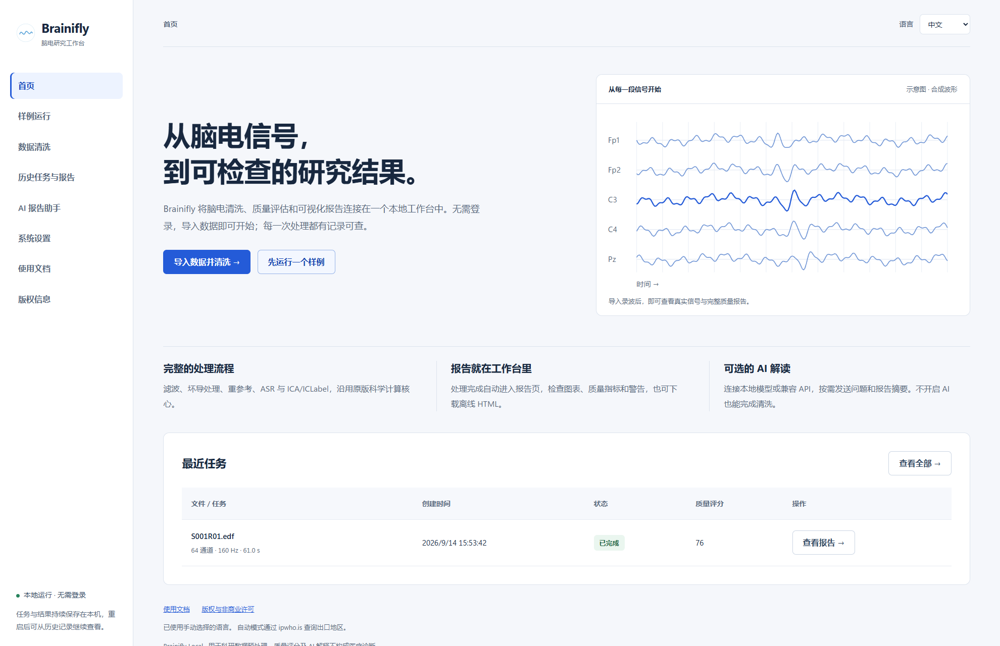
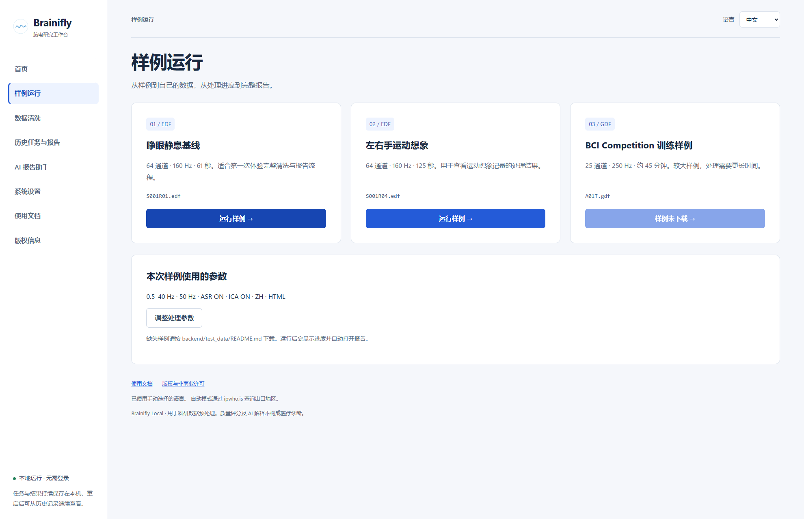
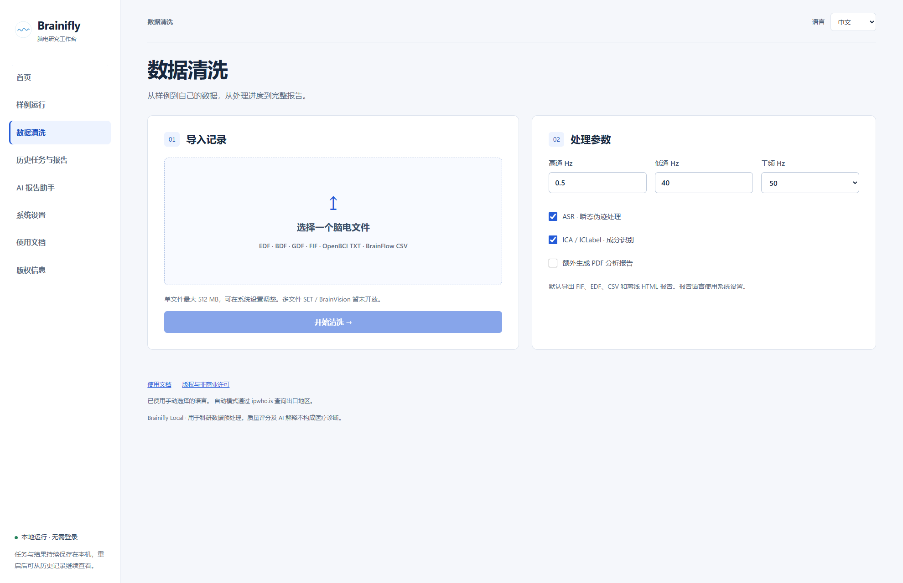
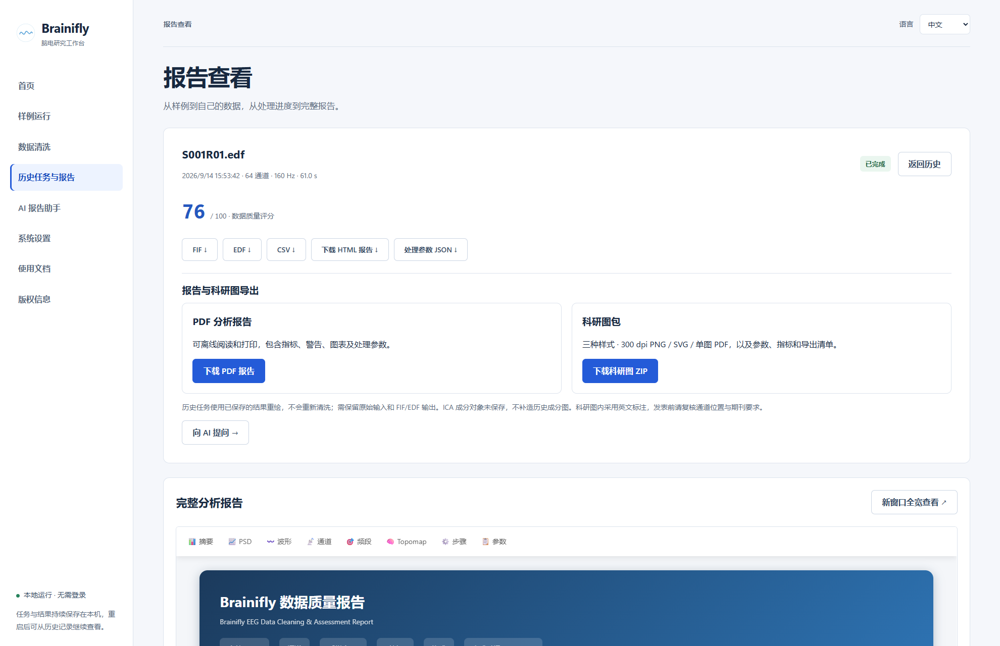
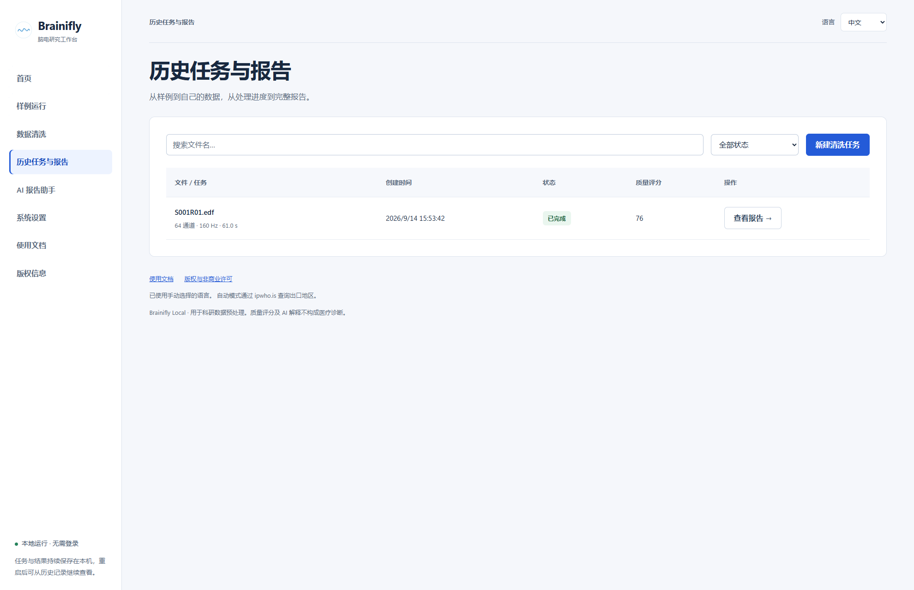
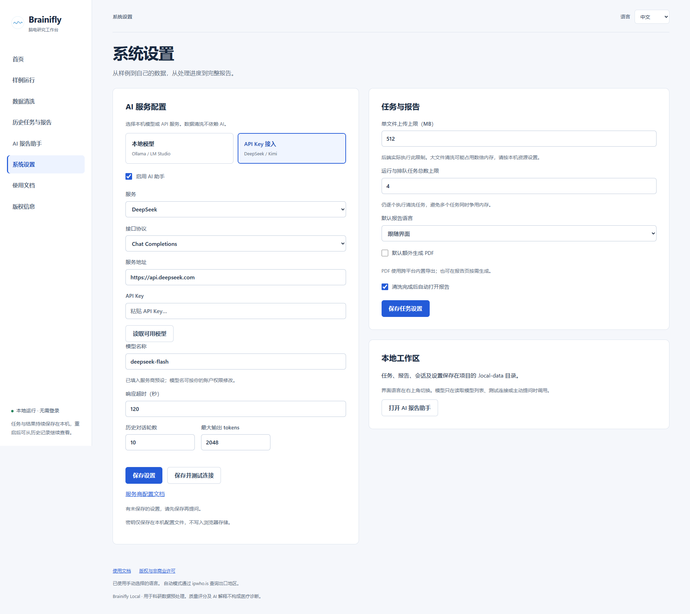
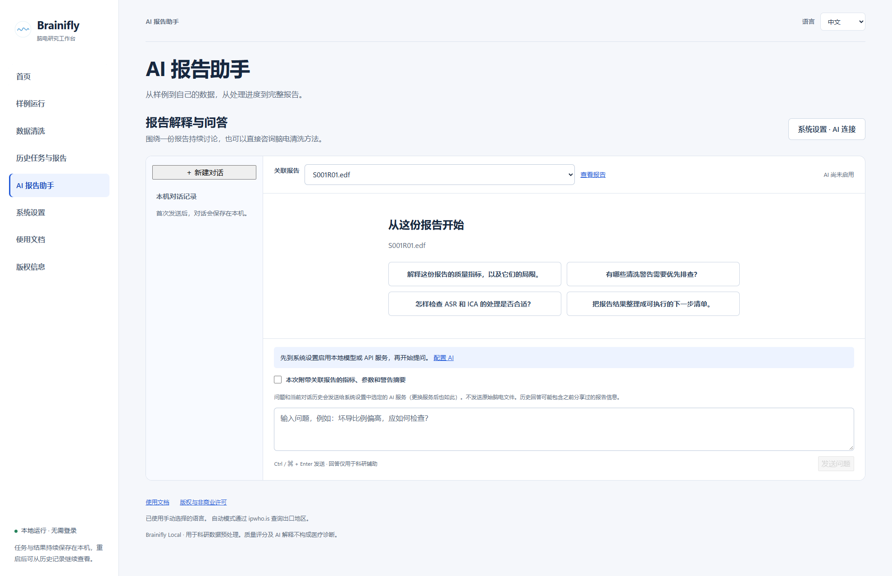

# OpenBrainEEG 使用手册

Brainifly Local · 2026-09-14

配图来自独立演示工作区的真实界面，使用公开 PhysioNet 样例，不含私人录波、真实 API Key 或 AI 生成结论。设置截图展示未保存的 DeepSeek 预设，未发起 AI 调用。英文界面的报告截图保留样例任务提交时的中文报告。

## 开始使用

OpenBrainEEG 是 Brainifly 的本地脑电研究工作台，无需登录。先运行一个公开样例，再处理自己的记录。

```text
python start.py setup
python start.py

# macOS
python3.11 start.py setup
python3.11 start.py
```

1. 安装 Python 3.11+ 与 Node.js 22，解压代码包，在包含 start.py 的文件夹打开终端。Windows 使用示例中的 python 命令，macOS 使用 python3.11（或已安装的 Python 3.11+）。
2. 首次执行 setup 安装依赖并构建页面，需要网络和足够的磁盘空间。以后直接启动，不必每次 setup。
3. 浏览器访问 http://127.0.0.1:8765，保持启动终端运行。右上角切换中文或 English。
4. 停止服务时按 Ctrl+C，等待任务正常退出；不要在处理中直接强制关机。



> 清洗使用本机计算资源，默认不启用 AI。本版仅供本机单用户运行，不要把服务公开到互联网。

## 运行第一个样例

仓库附带两个 PhysioNet EDF 文件。推荐先选 61 秒的睁眼静息基线，熟悉从进度到报告的流程。

1. 打开「样例运行」，确认 S001R01.edf 显示「运行样例」。第三个 GDF 样例不随代码分发，显示未下载是正常的。
2. 检查页面下方的参数。需要调整时，进入「数据清洗」修改，再回到样例页。
3. 点击第一个「运行样例」，进入任务进度页。处理耗时取决于硬件和参数，不要重复点击提交。
4. 任务完成后默认自动打开报告；关闭自动跳转时，点击「查看完整报告」或从历史记录打开。



> 样例仅演示软件流程，不代表任何个体的临床结论。数据来源与许可见版权页中的第三方说明。

## 导入与清洗自己的数据

清洗会生成新的输出。请保留独立的原始数据备份，先用短记录验证参数，再运行大文件。

1. 打开「数据清洗」，选择 EDF、BDF、GDF、FIF、OpenBCI TXT 或 BrainFlow CSV 单文件。TXT/CSV 必须符合对应采集软件格式，不是任意表格。SET 和 BrainVision 多文件格式暂不支持。
2. 设置高通、低通和 50/60 Hz 工频。界面默认 0.5–40 Hz、50 Hz；这些是起始值，应根据采样率和研究目标确认。
3. 按需启用 ASR 和 ICA/ICLabel。自动伪迹处理可能改变有效信号，完成后需检查处理日志、波形和成分结果。
4. 默认生成 HTML 报告；勾选「额外生成 PDF 分析报告」可在清洗结束时同时生成 PDF，也可完成后在报告页按需生成。点击「开始清洗」，关注失败原因及警告。
5. 超出上传限制时，先到系统设置调整上限，再重新选择或提交文件。大文件处理可能占用数倍于文件大小的内存。



> 上传大小和排队数是资源保护设置，不是收费额度；任务逐个执行。

## 查看、复核与下载报告

报告是可检查的处理记录。质量评分反映程序计算的指标，不是脑健康评分，也不是诊断。

1. 先核对文件名、通道数、采样率和时长，确认查看的是目标记录。
2. 先读警告，再检查完整报告中的质量指标和图表。部分步骤失败可能仍产生输出，不能只凭「已完成」判断结果可用。
3. 2K 显示器可使用页面内报告；需要更多空间时点击「新窗口全宽查看」。报告内部图表和章节可继续滚动浏览。
4. 下载 HTML 可离线查看；顶部同时提供 FIF、EDF、CSV、参数 JSON 等文件。「报告与科研图导出」中点击「生成 PDF 报告」，完成后点击「下载 PDF 报告」。无需重新清洗。
5. 展开「处理参数与步骤记录」保存复现依据。若需要讨论指标，点击「向 AI 提问」转到独立报告助手。
6. 点击「生成科研图包」，完成后下载 ZIP。包含黑白、彩色和演示三种样式的 300 dpi PNG、SVG、单图 PDF，以及参数、指标、步骤和 manifest.json。重绘需要保留原始文件与 FIF/EDF 结果；ICA 历史成分对象不恢复。缺图、缺坐标或部分失败请检查导出提示和清单。



> 复核时比较处理前后信号和研究所需频段；不要把更高分数理解为分析一定更正确。

## 历史任务与数据保存

关闭页面或重启服务不会删除已经保存的任务与报告。

1. 打开「历史任务与报告」，按文件名搜索，或按已完成、失败、处理中等状态筛选。
2. 完成的任务点击「查看报告」；未完成或失败任务点击「查看任务」，查看进度和错误。
3. 强制中断的任务不会自动恢复计算。重启后检查失败说明，再重新提交。
4. 任务、原始上传、结果、AI 设置和对话都在项目的 .local-data 目录。先停止服务，再备份整个目录。
5. 备份中可能含 API Key 和敏感录波，不能上传到公开仓库。当前没有自动清理或批量删除按钮，清理前请独立备份。



## 系统设置与 AI 连接

任务设置与 AI 连接分别保存。清洗不依赖 AI，配置服务后才需要进行连接测试。

1. 任务与报告：设置上传上限（1–8192 MB）、活动任务总数（1–16）、报告语言、默认 PDF 和自动打开报告，然后点击「保存任务设置」。新设置用于后续任务，不重写旧报告。
2. DeepSeek：选「API Key 接入」→ DeepSeek，检查 Chat Completions 协议和 https://api.deepseek.com 地址，粘贴你自己的 API Key。
3. 点击「读取可用模型」，选择账号支持的文本对话模型；也可按服务商文档手填模型 ID。预设名不保证永久有效。点击「保存并测试连接」，看到连接成功后再进入助手。
4. 本地 Ollama：先安装并运行 Ollama、下载本地文本模型；在本系统选择「本地模型」→ Ollama，地址 http://localhost:11434，读取或填写已安装模型名，再保存测试。此处不要额外加 /api。
5. LM Studio：先加载模型并启动本机服务；选择 LM Studio，地址通常为 http://localhost:1234/v1，使用 Chat Completions。端口按实际服务配置填写。
6. 更换服务或地址后重新填写密钥；同一服务留空可保留已存密钥。超时、历史轮数和输出上限也在这里调整，之后点击「保存设置」。



> 连接测试发送一条短问题，可能产生 API 费用，不发送录波或报告。API Key 保存在本机配置文件中，并非加密保险箱。本地地址也可能由代理转发到云端，请确认模型服务的实际运行方式。

[DeepSeek API](https://api-docs.deepseek.com/)

[Ollama API](https://docs.ollama.com/api/introduction)

[LM Studio](https://lmstudio.ai/docs/developer/openai-compat)

## AI 报告解释与问答

AI 助手是独立模块。它根据你主动发送的问题、选定的摘要和历史对话回答，不会自行读取原始脑电文件。

1. 确认系统设置中已经启用 AI 并测试成功。打开「AI 报告助手」，点击「新建对话」。
2. 在「关联报告」选择已完成任务，或不关联报告进行方法咨询。也可以从报告页点击「向 AI 提问」自动带入选择。
3. 需要模型了解报告时，勾选「本次附带关联报告的指标、参数和警告摘要」。仅选择报告不会自动发送摘要。
4. 输入问题或选择快捷问题，再点击「发送问题」；Ctrl / ⌘ + Enter 也可发送。示例：哪些警告需要人工复核？ASR 和 ICA 处理应如何检查？
5. 后续追问会按配置携带最近若干轮历史。切换服务后，当前对话历史也会发给新服务；之前分享的报告内容可能保留在历史回答中。
6. 历史会话保存在本机。一个会话固定关联一份报告，讨论其他报告时新建对话。请对照原报告检查 AI 结论和引用。



> 不需要 AI 时可在设置中关闭。AI 可能遗漏信息、误解指标或编造结论，不能作为诊断或治疗依据。

## 常见问题

先记录页面错误和任务警告，再定位原因。反馈时只提供脱敏信息。

1. 页面打不开：确认启动终端仍在运行，访问的是 http://127.0.0.1:8765。若端口占用，先检查是否已有本系统在运行。
2. 找不到 Node/Python：安装后重新打开终端，检查 node --version 和 python --version；macOS 检查实际 Python 命令。修改页面代码后需 python start.py build 再刷新。
3. 连接测试失败：401/403 检查密钥和权限；余额不足检查服务商账户；429 检查额度和限流；模型不存在时重新读取模型列表；超时检查网络、服务进程和超时设置。测试失败前设置可能已经保存，修改后再保存测试。
4. 本地模型连接被拒绝：确认模型服务已启动、端口一致且模型已安装。localhost 指运行后端的电脑，不是另一台电脑。
5. 清洗失败或结果异常：核对输入格式、采样率、通道、记录长度、内存及参数；查看任务错误和步骤警告。先用附带样例区分安装问题和数据问题。
6. PDF / 科研图导出失败：查看报告页的具体错误，确认原始输入和 FIF/EDF 输出仍在。旧安装缺少 reportlab 时运行 python start.py setup 更新依赖。修复后点击「重新生成」；HTML 和清洗状态不受导出失败影响。
7. 语言不合适：右上角手动选择。自动模式向 ipwho.is 查询出口地区；VPN 会影响结果。手动模式不发起新的地区查询。
8. 报告不能打开：从历史记录重新选择任务，检查 HTML 输出和文件是否仍存在；不要在服务运行时移动 .local-data。反馈时提供系统版本、复现步骤和脱敏错误，不附 API Key 或原始私人录波。

[License / 许可](../LICENSE.md) · [Third-party notices / 第三方说明](../LICENSING.md)
